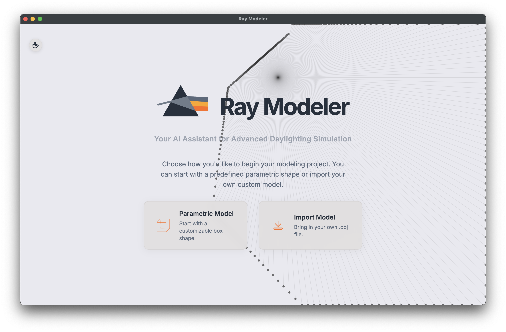
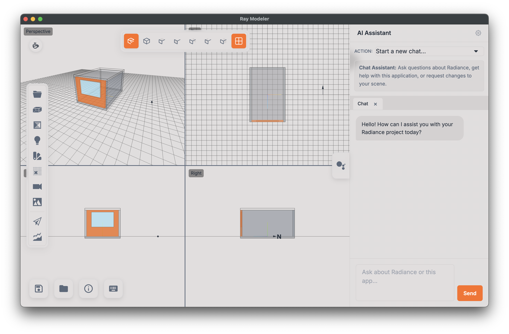

# Ray Modeler △

> **Editor's Note:** This is a passion project that I've been developing for the past year, primarily as a learning exercise. It is not intended for commercial use but rather as a tool to help others explore, learn, and understand Radiance simulations and how they can improve building design.
> Please consider this a **beta version**. The intent is to improve it over time, but many features have not been extensively tested. If you run into a bug, your feedback would be greatly appreciated!

Ray Modeler is a desktop application providing a graphical user interface (GUI) for the Radiance Lighting Simulation Suite. Integrated with an AI Assistant, it streamlines daylighting and electric lighting analysis, from 3D modeling to simulation and results visualization.



## Table of Contents

- [Ray Modeler △](#ray-modeler-)
  - [Table of Contents](#table-of-contents)

  - [✨ Core Capabilities](#-core-capabilities)
  - [🤖 AI Assistant (Helios)](#-ai-assistant-helios)
    - [AI-Powered Actions (Tool Use)](#ai-powered-actions-tool-use)
    - [Design Inspector](#design-inspector)
    - [Results Critique](#results-critique)
    - [Interactive Tutor](#interactive-tutor)
      - [Proactive Suggestions](#proactive-suggestions)
    - [Generative Design](#generative-design)
      - [Guide for Performing the Optimization](#guide-for-performing-the-optimization)
    - [API Key Configuration](#api-key-configuration)
    - [Getting Your API Key](#getting-your-api-key)
      - [Google Gemini API Key 🔑](#google-gemini-api-key-)
      - [OpenRouter API Key 🔑](#openrouter-api-key-)
      - [OpenAI API Key 🔑](#openai-api-key-)
      - [Anthropic API Key 🔑](#anthropic-api-key-)
  - [UI Walkthrough 💻](#ui-walkthrough-)
  - [📖 In-Depth Feature Guide](#-in-depth-feature-guide)
    - [📋 Scene Definition Panels](#-scene-definition-panels)
    - [📜 Simulation Modules (Recipes)](#-simulation-modules-recipes)
  - [Analysis Modules 📊](#analysis-modules-)

  - [License 📄](#license-)

## 🚀 Getting Started

To use Ray Modeler, you need a modern web browser and a local installation of the Radiance Lighting Simulation Suite. The desktop version (recommended) offers the best experience.

1. **Install Radiance**:
   Download and install [Radiance](https://www.radiance-online.org/) from the official website or the [NREL](https://github.com/NREL/Radiance) GitHub repository. Ensure the Radiance `bin` directory is in your system's PATH.

2. **Download Ray Modeler**:
   Download the latest release for your operating system (macOS or Windows) from the project's Releases page.

3. **Run the Application**:
   - *Windows*: Run the Ray Modeler Setup `.exe` installer.
   - *macOS*: Open the Ray Modeler `.dmg` and drag the application to your Applications folder.

**Security Warnings on First Launch**:

Because the app isn't code-signed, your OS might show a security warning. When a user on a Mac downloads and tries to open the unsigned app, they will be stopped by Gatekeeper, which will show a message like "Ray Modeler cannot be opened because the developer cannot be verified."

- **On Windows (SmartScreen)**: Click "**More info**", then click "**Run anyway**".

- **On macOS (Gatekeeper)**: **Right-click** (or Control-click) the app icon, select "**Open**" from the menu. A new dialog box will appear that is similar to the first one, but this time it will include an "**Open**" button. Clicking this will run the app. You only need to do this once. After the first successful launch, the app can be opened normally by double-clicking it. Or After you drag Ray Modeler.app to the Applications folder, do the following:

- Open the Terminal app.
- Copy and paste the following command exactly, then press Enter:

```bash
xattr -cr /Applications/Ray\ Modeler.app
```

---

## ✨ Core Capabilities

Ray Modeler is packed with features that automate and enhance the Radiance workflow:

- **Parametric Scene Modeling**: Define room dimensions, orientation, window-to-wall ratios (WWR), and shading devices like overhangs, light shelves, louvers, and roller shades.

- **Geometry Importer**: Import `.obj` models, with an interactive UI to tag surfaces (walls, floors, glazing) for simulation setup.

- **Context & Site Modeling**: Adding surrounding context, either through simple massing tools, topography from heightmaps, or by automatically fetching building data from OpenStreetMaps.

- **Interior Furniture Library**: Place simple furniture and partition objects from a pre-built library via drag-and-drop or import custom `.obj` assets..

- **Enhanced Drawing Tools**:
  - **Floor Plan Overlay**: Import a floor plan image (JPG/PNG) to use as a tracing guide with adjustable scale.
  - **Interior Partitions**: Draw internal partitions to subdivide spaces with intuitive wall thickening and real-time dimension rulers.
  - **Precision Controls**: Numeric input for exact lengths and snapping toggles for accuracy.

- **Radiance Material Editor**: Configure standard Radiance materials (`plastic`, `metal`, `glass`) by adjusting properties like reflectance, specularity, and roughness. It also supports spectral data (`.dat`) files for advanced material definitions.

- **Advanced Glazing Systems**: Model glazing using simple transmittance values or incorporate complex fenestration data via Bidirectional Scattering Distribution Function (BSDF) `.xml` files. The application converts intuitive transmittance to physically-based transmissivity for simulations.

- **Interactive BSDF Viewer**: When a BSDF `.xml` file is loaded, the application can parse the Klems matrix and render an interactive 2D polar plot showing the angular distribution of transmitted light for any incident angle.

- **Electric Lighting Design**: Place and configure Radiance light source types (light, spotlight, glow, illum) or import luminaire data using `.ies` photometric files in individual or grid-based layouts.

- **IES Photometry Viewer**: In addition to a 2D polar plot, visualize luminaire distributions with an interactive 3D photometric web and view key metadata like lumens and wattage directly from the `.ies` file.

- **Daylighting Controls**: Simulate energy savings by implementing photosensor-controlled lighting systems with continuous, stepped, or off modes.

- **Daylighting Control Zone Visualization**: Instantly visualize which luminaires are controlled by which photosensors with color-coded 3D gizmos, providing immediate feedback on the daylighting strategy.

- **Automated Radiance Workflow**: Generates a complete, organized project folder structure (e.g., 01_geometry, 04_skies, 07_scripts) and populates it with geometry files, material definitions, sensor points, and executable run scripts for both Windows (`.bat`) and macOS/Linux (`.sh`).

- **First-Person View (FPV) Mode**: Enter the Radiance viewpoint camera directly to preview the exact perspective, fisheye, or parallel view that will be rendered for analysis.

- **Saved Camera Views ("Snapshots")**: Save and load specific camera positions and angles, complete with thumbnails, to quickly return to key perspectives during analysis.

- **Advanced Annual Analysis**: Generate and view temporal heatmaps, glare rose diagrams, and combined daylight/glare scatter plots to deeply understand annual performance.

- **Recipe-Based Simulation Engine**: Automate complex Radiance workflows with pre-configured "recipes." The application generates all necessary geometry files, material definitions, and executable run scripts (`.sh`, `.bat`) in a standardized project folder. Includes recipes for `IES LM-83 (sDA/ASE)`, `EN 17037`, and `EN 12464-1`.

- **Geometry Optimization**: Automatic geometry cleanup process that removes overlapping surfaces and optimizes the model structure for efficient and error-free Radiance simulations.

- **Advanced Annual Methods**: Support for industry-standard annual simulation methods, including 3-Phase and 5-Phase Daylight Analysis.

- **Spectral Lighting Analysis**: A full implementation of the Lark methodology to run multi-channel simulations and calculate non-visual lighting metrics like melanopic and neuropic illuminance.

- **Automated Compliance Workflows**: Specialized recipes for checking compliance with major industry standards, including `IES LM-83 (sDA/ASE)`, `EN 17037 (Daylight in Buildings)`, and `EN 12464-1 (Light and lighting of work places)`.

- **Interactive HDR Image Analysis**: View High-Dynamic Range (HDR) renderings with exposure controls, toggle false-color luminance mode, and use a mouse-over probe to get exact cd/m² values. Detected glare sources can be overlaid directly onto the image for verification.

- **Live Sun Ray Tracing**: Visualize direct sun penetration in real-time. Trace a grid of rays from the sun's current position (calculated from the EPW file for any date/time) through glazing surfaces and see how they bounce around the interior, helping to quickly identify potential glare spots or assess daylight distribution.

- **File System Integration**: Using the File System Access API (or Electron's APIs), Ray Modeler can directly read from and save to a local project folder, enabling a seamless desktop-like experience.
  
- **AI Assistant (Helios)**: An integrated, context-aware AI chat powered by generative AI (Google Gemini, Anthropic, OpenAI, OpenRouter models) to help answer questions and directly manipulate the scene, run simulations, and control the UI using natural language commands.

- **Automated Report Generation**: Generate comprehensive HTML reports with a single click. The report includes project details, a 3D scene snapshot, key performance metrics (sDA, ASE, DGP), and all generated dashboard charts (UDI, Glare Rose), ready for printing or saving as a PDF.

- **Interactive Data Table**: Inspect raw simulation data in a sortable, filterable table. Click on any row to instantly highlight the corresponding sensor point in the 3D model, linking numerical data directly to its spatial context.

- **Daylight Autonomy Heatmaps**: Visualize annual performance not just as point-in-time illuminance, but also as Daylight Autonomy (DA), showing the percentage of occupied hours that each sensor point meets a specific illuminance threshold.

- **Climate Data Analysis**: Generate an interactive dashboard from the loaded EPW file, including a wind rose, solar radiation charts, and temperature profiles to better understand the site context.

- **Advanced Circadian Health Dashboard**: Analyze results from spectral simulations to calculate and visualize key circadian lighting metrics like Circadian Stimulus (CS), Equivalent Melanopic Lux (EML), and check for compliance with WELL building standards.

- **Keyboard Shortcuts**: Accelerate your workflow with keyboard shortcuts for common actions, such as `T` for Top View, `P` for Perspective, and `Ctrl+S` to save the project. A help modal (`?`) displays all available shortcuts.

- **Multi-View Layout (Quad View)**: Split the main viewport into four synchronized cameras (Perspective, Top, Front, Side) for comprehensive spatial awareness and precise object placement, a standard in professional 3D software.

- **Vegetation & Tree Modeling**: Add simple procedural trees and bushes from the Scene Elements library to your site. The vegetation canopy uses a Radiance `trans` material to accurately simulate its light-filtering effects, improving the realism of site-specific analyses.

## 🤖 AI Assistant (Helios)

The AI Assistant panel provides a chat interface to help you with your workflow. It has been upgraded to a **semi-autonomous agent** capable of multi-step reasoning, complex task execution, and long-term memory.

### 🧠 Agentic Capabilities (New)

-   **Autonomous Execution (YOLO Mode)**:
    -   **Standard Mode**: For safety, the agent asks for confirmation before executing any tool (e.g., "Shall I add the window?").
    -   **YOLO Mode (⚡)**: Toggle this mode to allow the agent to execute safe actions immediately without interruption.
    -   **Safety First**: Destructive actions (like deleting geometry or resetting projects) *always* require confirmation, even in YOLO mode.

-   **Visible Thought Process**:
    -   See exactly what the agent is thinking. The chat now displays a collapsible "Thinking..." section where you can watch the agent plan its next steps, choose tools, and analyze results in real-time.

-   **Long-Term Memory**:
    -   Helios now remembers your preferences and project details across sessions. Tell it your favorite analysis settings once, and it will recall them next time.

-   **Active Context Awareness**:
    -   The agent knows what you are looking at. Select a wall or object in the 3D view, and simply say "add a window here" or "change this material" without needing to specify the object name.

---

### AI-Powered Actions (Tool Use)

Beyond answering questions, the assistant can directly manipulate the UI and query project data. This allows for a powerful natural language workflow. Its capabilities include:

- **Project Validation**: Ask it to `"validate my project for an annual glare simulation"` and it will check for common setup errors, such as a missing weather file or an incorrect viewpoint type, and report back any issues.
- **Advanced Scene Manipulation**:
  - **Shading**: `"Add a 0.5 meter deep overhang to the south wall."`
  - **Sensor Grids**: `"Enable a sensor grid on the floor with 0.75m spacing."`
  - **Daylighting**: `"Enable continuous daylighting controls with a setpoint of 500 lux."`
- **Simulation & Recipe Control**:
  - **Global Parameters**: `"Set the global ambient bounces to 5."`
  - **Recipe Configuration**: `"In the open illuminance recipe, change the time to 9:00 AM."`
- **Conversational Data Exploration & Comparison**:
  - **Data Query**: `"What is the average illuminance for the current results?"` or `"How many points are above 500 lux?"`
  - **Time Scrubbing**: `"Show me the results for the winter solstice at noon."`
  - **Dashboard Control**: `"Open the glare rose diagram."`
  - **Comparative Analysis**: `"Which of my two designs has better daylight uniformity?"` or `"Compare the sDA for both designs."`
- **File Management**:
  - **Load Results**: `"Load a results file into dataset A."`
  - **Clear Results**: `"Clear all loaded results data."`

### Design Inspector

The AI analyzes the entire project state to identify conflicting or suboptimal combinations of settings, explains the potential consequences, and offers a one-click fix.

> **AI Analysis:** "I've reviewed your project. Your wall reflectance is quite low (0.2), and you're only using 2 ambient bounces. This combination will likely result in an unrealistically dark rendering with noticeable splotches. I recommend increasing ambient bounces to 4 and wall reflectance to 0.5."
> **[Apply Fixes]**

### Results Critique

After a simulation completes, the AI can analyze the results, identify problems, and suggest specific, actionable design changes.

> **AI Analysis:** "The Daylight Glare Probability (DGP) is 0.47, which is considered 'Intolerable'. This is caused by low-angle sun from the west-facing window. To fix this, I suggest adding vertical louvers."
> **[Add Vertical Louvers]**

### Interactive Tutor

The AI can act as a tutor to guide new users through complex simulation workflows step-by-step, teaching them the process as they go.

#### The User Experience

*   **Activation**: You ask Helios to "Start a walkthrough for Daylight Factor" or "Teach me how to run a glare analysis."
*   **Visual Change**: The chat header turns blue (accent color), and a "🎓 Tutor Mode Active" badge appears at the top of the chat. This confirms you are in a guided session.
*   **Step-by-Step Guidance**: Instead of a generic response, Helios will:
    *   Explain the goal of the current step (e.g., "First, we need to set the location").
    *   Provide specific instructions or even use tools to open the relevant panels for you.
    *   Wait for you to confirm you've done it before moving to the next step.
*   **Completion**: Once the workflow is done, or if you click "End" on the badge, Helios returns to its normal "Master Assistant" mode.

> **User**: "How do I run a glare simulation?"

> **AI**: "Of course! To calculate DGP, we need a 180° fisheye view. Your current viewpoint is set to Perspective. Would you like me to change it for you?"

> **User**: "Yes"

> **AI**: *(Changes viewpoint)* "Great. Next, I'll open the DGP recipe panel for you." *(Opens recipe)* "Now you just need to click 'Generate Package' and run the simulation."

#### Proactive Suggestions

The AI Assistant monitors user actions and provides contextual, non-intrusive suggestions to guide the workflow and prevent common errors. These suggestions appear as dismissible chips in the UI. For example:

- After loading an **EPW weather file**, it will suggest opening an annual simulation recipe.
- If a material's **reflectance is set to an unusually high or low value**, it will warn that this may be physically unrealistic.
- If the user enables a **View Grid**, it will suggest opening the Imageless Annual Glare recipe.
- If the **DGP recipe is open but the viewpoint is not set to fisheye**, it will offer to correct the setting.
- If **Global Ambient Bounces (`-ab`) are set below 2**, it will warn that this can lead to unrealistic, dark, or splotchy results.

### Generative Design

Leverage the AI to perform automated, multi-step design tasks.

- **Scene Creation from Natural Language**: Instead of manually adjusting sliders, describe the space you want to build in plain English.

    > "Create a long office, 12 meters deep by 5 meters wide, with a 3-meter high ceiling. Put a large, continuous window across the entire south wall with a sill height of 0.8 meters. Add a 1-meter deep overhang above it and place two desks in the middle of the room."
- **Design Optimization**: Define a goal, constraints, and a design variable, and the assistant will orchestrate the entire workflow to find the best solution. For example:

    > "Find an overhang depth for the south wall between 0.5m and 2.0m that maximizes sDA while keeping ASE below 10%."

- **Design Optimization (Genetic Algorithm)**: This major feature is now accessible via a new "Optimization" tab in the Helios panel. It uses a **Genetic Algorithm** to automatically find high-performing shading designs by running numerous headless simulations in the background.

The UI allows you to:

- Select a **Target Wall** and **Shading Type** (Overhang, Louver, etc.).
- Choose up to 3 **Parameters** to optimize (e.g., `depth`, `tilt`).
- Define a **Goal** by selecting a **Recipe** (e.g., `sDA & ASE`, `Imageless Annual Glare`, `Spectral Analysis (Lark)`) and a **Metric** (e.g., `Maximize sDA`, `Minimize Annual DGP Avg`, `Maximize Circadian Stimulus`).
- Set a **Goal Type**: `Maximize`, `Minimize`, or `Set Target Value` (e.g., set sDA to exactly 55%).
- Set an optional **Constraint** (e.g., `ASE < 10`).
- Apply **Preset Profiles** like "Maximize Daylight" or "Minimize Glare".
- Receive a **Performance Warning** when selecting computationally expensive annual recipes, recommending the "Quick Optimize" mode.
  
The AI Assistant can fully control this workflow with commands:

- `"Open the optimization panel for the south wall overhang"`
- `"Apply the 'minimize-glare' profile"`
- `"Configure the optimization to maximize sDA with a constraint of ASE < 10"`
- `"Configure a multi-objective optimization to maximize sDA and minimize ASE"`
- `"Start a 'quick' optimization run"`
- `"Suggest a good range for louver slat angle"`
- `"Analyze the optimization results"`

- **AI-Suggested Parameter Ranges**: Before running a full optimization, ask Helios to find the most effective range for a parameter (e.g., `"suggest a good range for overhang depth"`). It runs a quick analysis to find the "sweet spot," helping you avoid testing ineffective values.

- AI-Powered Trend Analysis: After a run, ask Helios to `"analyze the optimization results"`. It will analyze the *entire* dataset (not just the best results) to provide high-level insights on parameter sensitivity and key performance trends.

#### Guide for Performing the Optimization

The "Optimization" tab in the Helios panel is a dedicated interface for running Generative Optimization studies. Its purpose is to automatically find the best possible shading design (like an overhang, louver, or lightshelf) by running many simulations in the background. You define the goals (e.g., "maximize daylight") and constraints (e.g., "keep glare low"), and the optimizer "evolves" solutions to find the best-performing design parameters. While the other tabs are for chatting with Helios, this tab provides a specific UI for this powerful feature. However, Helios (the AI) is deeply integrated to help you set up, run, and understand the results. Here is a guide on how to use it, covering both the manual process and how Helios can assist you.

**First Step:** The Info Panel For a detailed guide built directly into the app, click the info button (ⓘ) at the top right of the Optimization panel. This will open the "About Generative Optimization" modal, which explains the entire process, including the AI-powered features.

How to Manually Run an Optimization You can configure and run an optimization yourself by following these steps:

1. **Set Context**:
  
- **Target Wall**: Select the wall (e.g., "South") where you want to optimize the shading.
- **Shading Type**: Choose the device you want to test (e.g., "Overhang").

2. **Choose Optimization Type**:

- **Single-Objective (SSGA)**: Use this to find the single best design for one goal (e.g., "Maximize sDA") while meeting an optional constraint (e.g., `ASE < 10`).
- **Multi-Objective (MOGA)**: Use this to explore the trade-offs between two competing goals (e.g., "Maximize sDA" vs. "Minimize Glare"). This won't give you one "best" answer, but a set of optimal compromises (the "Pareto Front").

3. **Define Parameters (The "Genes")**:

- In the "Parameters to Optimize" section, check the box next to the parameters you want the algorithm to change (e.g., `depth`, `tilt`).
- You must set a valid **Min** and **Max** range for each parameter you select. This defines the "search space" for the optimizer.

4. **Define Your Goal(s)**:

- Select the simulation **Recipe** (e.g.,`sda-ase`).
- Select the **Metric** you want to optimize (e.g., `maximize_sDA`).
- If using SSGA, you can add a **Constraint**s(e.g., `ASE < 10`) to filter out bad designs.
  
5. **Configure Run Settings**:

- **Population**: The number of designs to test in each "generation." (10-20 is typical).
- **Max Evals / Gens**: The total number of simulations to run (for SSGA) or the number of generations to evolve (for MOGA). More evaluations take longer but can produce better results.
- **Quality**:sThe simulation quality for each test. **Medium** is recommended for a balance of speed and accuracy.
  
6. **Run and Analyze**:

- Click **"Start Optimization."** The "Progress Log" will show the status.
- The **"Results"** list will fill with the best-performing designs as they are found.
- You can click any design in the list and then click **"Apply Selected Design"** to instantly see it in the 3D scene.

✨ **How to Use Helios (The AI) for Optimization**
This is the most powerful workflow. Instead of (or in addition to) using the manual form, you can use Helios in the **Chat** tab to assist you at every step.

1. **AI-Powered Setup** You can ask Helios to configure the entire optimization for you. Go to the "Chat" tab and ask:

  > "Helios, set up an optimization for the south wall. I want to find the best overhang depth and tilt to maximize sDA, but keep ASE below 10%." Helios will use its `configureOptimization` tool to fill out the entire form in the Optimization tab for you. It will then ask you to review the settings and click "Start Optimization" when you are ready.
  
2. **AI-Suggested Parameter Ranges (Most-Recommended)** Not sure what **Min** and **Max** ranges to set for a parameter? Ask Helios to find out. Go to the "Chat" tab and ask:

  > "Before I run a full optimization, can you suggest a good range for the 'overhang depth' on the south wall to maximize sDA?" Helios will use its `suggestOptimizationRanges` tool to:

  > - Run a special "quick optimize" on **only** that one parameter (e.g., 'depth') across a very wide default range (e.g., 0.1m to 3.0m).
  > - Analyze the results to find the "sweet spot," cutting off the worst-performing 15% and the 5% that give diminishing returns.
  > - It will then report back with a recommended range (e.g., "The most effective range appears to be `[0.4m, 1.3m]`. I recommend using this in your full optimization."). This saves you from wasting hours testing ineffective parameter ranges.

3. **AI-Powered Trend Analysis (After a Run)** The "Results" list only shows you thesbestdesigns. To understand *why* they performed well, you can ask Helios to analyze the full data from the run. After your optimization is complete, go to the "Chat" tab and ask:

  > "Helios, please analyze my last optimization run and tell me what you found." Helios will use its `analyzeOptimizationResults` tool to get the data from *every single simulation it ran* (not just the best ones). It will then provide a high-level summary of trends and insights, such as:

  > - "I found that **'slat-angle' was the most critical parameter** for minimizing glare."
  > - "Performance for 'depth' improved up to 1.2m, but then had diminishing returns, so there is no benefit to making it larger."
  > - "'Slat-width' had almost no impact on performance, so you can choose that based on cost or aesthetics."

**About Generative Optimization**
This panel uses Genetic Algorithms (GAs) to automatically find high-performing shading designs. You define the goals and constraints, and the algorithm "evolves" solutions over time by running many simulations in the background.

**How to Run an Optimization (Step-by-Step)**

1. **Set Optimization Context**:

- **Target Wall**: Select the wall (N, S, E, W) where the shading will be optimized.
- **Shading Type**: Choose the device to optimize (e.g., Overhang, Louver).
  
2. **Choose Optimization Type**:

- **Single-Objective (SSGA)**: Finds the single "best" design for one specific goal (e.g., maximize sDA) while adhering to an optional constraint (e.g., ASE < 10).
- **Multi-Objective (MOGA)**: Explores the "trade-offs" between two competing goals (e.g., maximizing sDA vs. minimizing glare). It returns a set of optimal compromises, known as the Pareto Front.

3. **Define Parameters to Optimize**:

- Check the box next to the parameters you want the algorithm to change (the "genes").
- Set the **Min** and **Max** values to define the "search space" for each parameter.
- **Pro Tip:** Not sure what range to set? Ask Helios to **"suggest a good range for overhang depth"**. It will run a quick analysis to find the most effective range.

4. **Set Your Goal(s)**:

- **For SSGA:** Select the **Recipe** (simulation type) and the **Metric** you want to optimize. Set the **Goal Type**(Maximize, Minimize, or Set Target). Add an optional **Constraint** to filter out bad designs (e.g., `ASE < 10`).
- **For MOGA:** Configure **Objective 1** and **Objective 2**. Both metrics must come from the same simulation recipe (e.g., sDA and ASE both come from the `sda-ase` recipe).

5. **Configure Run Settings**:

- **Population**: Number of designs in each generation (e.g., 10-20).
- **Max Evals / Gens**: The total number of simulations (for SSGA) or generations (for MOGA) to run. This controls the total runtime.
- **Quality**: Simulation quality. **Medium** is recommended for a balance of speed and accuracy.

6. **Run the Optimization**:
   
- **Start Optimization**: Begins the full run.
- **Quick Optimize**: Runs with smaller settings for a fast, preliminary result.

7. **Analyze and Apply Results**:

- As the optimization runs, the **Results** list will fill with the best solutions found so far.
- **For MOGA**, this list is the **Pareto Front**, showing the best trade-offs.
- Click any design in the list to select it.
- Click **"Apply Selected Design"** to apply its parameters to the 3D scene.
- After the run, ask Helios to **"analyze the optimization results"** for a high-level summary of parameter trends and insights.

    **AI-Powered Assistance**
    Helios is integrated with this panel to help you get better results, faster.
    **1. AI-Suggested Parameter Ranges** Before running a full, time-consuming optimization, you can ask Helios to find the most effective range for a single parameter.

- **How it works:** When you ask (e.g., "suggest a range for overhang depth"), Helios runs a 'quick optimize' on that one parameter across a very wide default range (e.g., 0.1m to 3.0m).
- It then analyzes the results to find the "sweet spot"—it cuts off the "worst" 15% of designs and the 5% "diminishing returns" tail.
- **Result:** Helios will suggest an optimized range (e.g., "[0.4, 1.2]") for you to use in your full optimization, saving you from wasting time testing ineffective parameter values.
    **2. AI-Powered Trend Analysis** After a run is complete, the results list only shows the *best* designs. To understand *why*they were the best, you can ask Helios to analyze the full dataset.

- **How it works:** When you ask (e.g., "analyze my optimization results"), Helios uses the `analyzeOptimizationResults` tool to get the data from *all* evaluations, not just the best ones.
- It then performs a trend analysis to provide a high-level summary.
- **Result:** Helios will give you insights like:
- **Key Trends:** "sDA improved as 'depth' increased, but dropped off after 1.5m."
- **Parameter Sensitivity:** "'Slat Angle' was the most critical driver of performance, while 'Slat Width' had almost no impact and can be chosen based on cost."

    **Optimization Methodologies**
    **Single-Objective (SSGA)** This uses a **Steady-State Genetic Algorithm (SSGA)**. It is efficient for finding the single best solution for one goal.

    1. **Initialization:** Creates an initial "population" (e.g., 10) of random designs.
    2. **Evaluation (Fitness):** Each design is simulated, and its performance on your **Goal Metric** (e.g., sDA score) becomes its "fitness."
    3. **Selection:** Selects two "parent" designs using **Tournament Selection** (the best of 3 random picks).
    4. **Crossover & Mutation:** The two parents are "bred" to create two new "child" designs, with a small chance of random mutation.
    5. **Replacement:** The two new children are evaluated (simulated). They are added to the population, and the two **worst-performing** designs are removed.
    6. **Repeat:** This "select, breed, evaluate, replace" loop repeats until the **Max Evaluations** is reached.
    **Multi-Objective (MOGA / NSGA-II)** This uses a **Non-dominated Sorting Genetic Algorithm II (NSGA-II)**, a powerful method for finding a set of optimal trade-offs (the "Pareto Front").
    1. **Initialization:** Creates and evaluates an initial N-sized population.
    2. **Sorting:** The population is sorted into "fronts" based on dominance. A design "dominates" another if it is better in at least one objective and not worse in any others. All non-dominated designs are on Rank 1 (the Pareto Front).
    3. **Selection:** Parents are selected using a **Crowded-Tournament**, which prefers designs with a better rank (lower is better) and, if ranks are equal, a higher "crowding distance" (more unique).
    4. **Crossover & Mutation:** Child designs (size N) are created from the selected parents.
    5. **Combine & Re-Sort:** The parent (N) and child (N) populations are combined into one 2N-sized group and evaluated.
    6. **Elitism (Replacement):** A new N-sized population is built by taking all designs from Rank 1, then all from Rank 2, and so on, until the population is full.The last front is sorted by crowding distance to ensure diversity.
    7. **Repeat:** This loop repeats for a fixed number of **Max Generations**.
    **Key Feature: Fitness Caching** If the algorithm generates a design it has already simulated, it retrieves the score from its memory (`fitnessCache`) instead of running a new simulation. This dramatically speeds up the process. This cache is also enhanced to store the raw metrics (e.g., `{sda: 80, ase: 5}`) for every run, which is what powers the AI Trend Analysis tool.
    **Configuration Options Explained**
  - **Optimization Type:** Choose between finding a single best solution (SSGA) or a set of trade-offs (MOGA).
  - **Shading & Parameters:** The "genes" for the algorithm. You must select at least one parameter (up to 3) and define the `min`, `max`, and `step` values.
  - **Goal & Constraints (SSGA):** The "fitness function" the algorithm tries to improve, and a "pass/fail" rule (e.g., `ASE < 10`) to filter out bad designs.
  - **Objectives (MOGA):** [The two competing goals (e.g., `maximize_sDA` and `minimize_ASE`) used to sort the population into fronts.
  - **Population:** The number of designs in each generation.
  - **Max Evals / Gens:** The total number of simulations (for SSGA) or generations (for MOGA) to run.
  - **Quality:** The Radiance preset to use for each simulation (`draft`, `medium`, `high`). **Medium** is recommended.
    **Benefits & Limitations**
  - **Benefit:** Automates the tedious task of iterating on a design. It can find non-obvious, high-performing combinations of parameters.
  - **Benefit:** MOGA allows you to explore the *trade-offs* between goals, rather than just finding one solution that might be good at one thing but terrible at another.
  - **Limitation:** This is a stochastic (random) process. It is not *guaranteed* to find the absolute single best solution, but it is very good at finding globally "good" solutions.
  - **Limitation:** The process is computationally expensive. A run of 50 evaluations can still take a significant amount of time.
    **What Happens When You Click "Start"**
    The `evaluateDesignHeadless` function orchestrates the entire process for each design:

    1. Applies the new design parameters (e.g., `depth: 0.7`) to the 3D scene.
    2. Programmatically generates a new simulation package (geometry, scripts, etc.) with a unique ID.
    3. Runs the simulation script headlessly in the background.
    4. Waits for the script to finish, then reads the unique result files (e.g., `_sDA_final.ill`).
    5. Parses the results, calculates the fitness score(s), and checks against any constraints.
    6. Returns this score to the optimizer, which then repeats the loop.
    **Final Result:** When the process is complete, the results list will show the best solution(s). For SSGA, the best design is automatically selected and can be applied. For MOGA, you can click on any of the trade-off solutions and click "Apply Selected Design" to see it in the 3D scene.

---

### API Key Configuration

The integrated AI Assistant requires an API key to function. It supports multiple providers for greater flexibility.

- **Expanded Provider Support**: Select between **OpenRouter**, **OpenAI**, **Google Gemini**, and **Anthropic**.
- **Provider-Specific Keys**: The application saves a separate API key for each provider, so you can switch between models without re-entering credentials.
- **AI Configuration**: A settings modal allows you to select your preferred provider, choose from a list of popular models (e.g., **Gemini 2.5 Pro**, **GPT-5**, **Claude 4.5 Sonnet**), or enter a custom model ID. The app also supports many free and lite models available through OpenRouter.

---

### Getting Your API Key

#### Google Gemini API Key 🔑

You can get a free API key for the Gemini family of models from [Google AI Studio](https://aistudio.google.com/prompts/new_chat).

1. Go to the Google AI Studio website.
2. Sign in with your Google account.
3. Click the "`Get API key`" button, usually located in the top-left or top-right corner of the page.
4. A dialog will appear. Click "`Create API key`".
5. Your new API key will be generated and displayed.
6. Copy this key and paste it into the API Key field in the Ray Modeler AI settings.
*Note*: The Gemini API has a free tier with usage limits. Be sure to review Google's current pricing and terms of service.

#### OpenRouter API Key 🔑

OpenRouter provides access to a wide variety of models from different providers through a single API.

1. Go to the [OpenRouter.ai](https://openrouter.ai/) website and log in.
2. Click on your account icon in the top-right corner and select "`Keys`" from the dropdown menu.
3. Click the "`+ Create Key`" button. Give your key a name (e.g., "RayModeler") and click "`Create`".Your new API key will be generated.
4. Copy this key and paste it into the API Key field in the Ray Modeler AI settings.
*Note*: OpenRouter is a paid service. You will need to add credits to your account to use most models. To use some of the free models, you may need to adjust your privacy settings to allow your data to be used for model improvement.

#### OpenAI API Key 🔑

1. Go to the [OpenAI API keys](https://platform.openai.com/api-keys) page and log in.
2. Click the "`+ Create new secret key`" button.
3. Give your key a name (e.g., "RayModeler") and click "`Create secret key`".
4. Copy the generated key immediately and paste it into the API Key field in the Ray Modeler AI settings. You will not be able to view it again.

#### Anthropic API Key 🔑

1. Go to the [Anthropic Console](https://console.anthropic.com/) and log in.
2. Navigate to the "API Keys" section in your account settings.
3. Click the "`Create Key`" button.
4. Give the key a name and click "`Create Key`".
5. Copy the key and paste it into the API Key field in the Ray Modeler AI settings.

#### Ollama Setup (Local AI) 🦙

Ollama allows you to run powerful LLMs locally on your own machine, completely free and private.

1. **Download Ollama**: Go to [ollama.com](https://ollama.com/) and download the installer for your OS (macOS, Windows, or Linux).
2. **Install & Run**: Run the installer and open the Ollama application. It runs in the background.
3. **Pull a Model**: Open your terminal or command prompt and run a command to download a model. For example:
   ```bash
   ollama pull llama3
   ```
   *Popular models*: `llama3`, `mistral`, `gemma`, `phi3`.
4. **Configure Ray Modeler**:
   - Open Ray Modeler and go to **AI Settings**.
   - Select **Ollama (Local)** as the Provider.
   - The **Base URL** defaults to `http://localhost:11434`, which is standard. Change it only if you have configured Ollama differently.
   - Select your model from the list (e.g., Llama 3).
   - *Note*: No API key is required for local Ollama.

**Important**: Treat your API keys like passwords. Do not share them publicly or commit them to version control.

## UI Walkthrough 💻

The interface is designed around a logical workflow, guiding the user from setup to analysis.





- **3D Viewport (Center)**: This is the main interactive area where your 3D scene is displayed. You can navigate using standard orbit controls (mouse drag, scroll). The viewport can also be split into a **Quad View** layout, showing synchronized Perspective, Top, Front, and Side cameras for comprehensive spatial awareness.

- **Left Toolbar**: This is the primary command center for building your scene. It contains buttons to open floating panels for defining all aspects of the physical model, from **Project Setup** and **Dimensions** to **Simulation** and **Analysis** modules.

- **Top View Controls**: A quick-access toolbar to instantly switch between standard orthographic (Top, Front, etc.) and perspective camera views. It also includes the button to toggle the **Quad View** layout.

- **Bottom Toolbar (Bottom-Left)**: Provides quick access to global actions like saving/loading project files, viewing application information and keyboard shortcuts, and launching the AI Assistant.

- **Floating Panels**: All scene definition, simulation, and analysis tools open as independent floating windows. These panels can be dragged, resized, collapsed, and arranged anywhere on the screen, allowing you to create a workspace tailored to your needs.

- **AI Assistant Sidebar (Right)**: A dedicated, resizable sidebar that houses the conversational AI Assistant. This keeps the AI's powerful capabilities accessible without cluttering your modeling and analysis workflow.

## 📖 In-Depth Feature Guide

### 📋 Scene Definition Panels

The panels on the left toolbar are used to define the scene.

- **Project Setup**: This is the starting point for any analysis.

  - *Project Details*: Define project name, description, and building type.
  
  - *Radiance Path*: Specify the local installation path for the Radiance binaries. The application provides a helpful reminder and defaults based on your OS.
  
  - *Climate & Location*: Upload an (`.epw`) weather file to auto-populate location data or set latitude/longitude manually using an interactive map.
  
  - *Occupancy Schedule*: A utility to generate an 8760-hour occupancy schedule file (`.csv`) based on selected days of the week and occupied hours. This file can be used in annual glare and daylighting control simulations.

- **Dimensions**: Set the foundational geometry of the room.

  - *Geometry Mode*: Choose between **Parametric** (for the simple box model) or **Imported** (for complex models).
  
  - *Parametric Controls*: Set the **Width (X), Length (Z), Height (Y)** and rotate the entire room with the **Orientation** slider.
  
  - *Geometry Importer*: Import `.obj` models. Includes tools for automatic scaling and centering. After import, a **Surface Tagger** UI appears, allowing you to assign Radiance-relevant surface types (wall, floor, glazing, etc.) to each material from the original file.

- **Apertures & Shading**: Control openings and shading systems on a per-wall basis.

  - *Wall Selection*: Click on a wall in the 3D view to select it for editing. The selection can be locked to prevent accidental changes.
  
  - *Aperture Mode*: Define windows using either Window-to-Wall Ratio (WWR) or a Manual mode for precise control over width, height, and sill height.
  
  - *Shading Devices*: Each wall can have its own complex shading system, including:
  
    - Overhangs, Light Shelves, Louvers, and Roller Shades with detailed parametric controls.
    - **Imported OBJ**: Import a custom shading device from an `.obj` file, with in-scene controls for position, rotation, and scale.

- *Interactive Sun Ray Tracer*: Integrated directly into the wall selection workflow, this tool allows you to trace a specified number of rays from the sun's position for any date and time. It provides immediate visual feedback on sun penetration and internal reflections.

- **Artificial Lighting**: Add and configure electric light sources.

  - *Light Source Types*: Choose from standard Radiance primitives or upload an `.ies` file.
  
  - *Interactive IES Photometry Viewer*: When an `.ies` file is loaded, the application generates an interactive 2D polar plot and a **3D Photometric Web** to visualize the luminaire's distribution. Key data like total lumens, wattage, and efficacy are also displayed.

  - *Daylighting Controls*: Define up to two photosensors with 3D position and direction vectors to create distinct control zones.
  
  - *Interactive Control Zone Visualization*: A "Visualize Control Zones" toggle color-codes the 3D luminaire gizmos based on their assigned sensor, providing immediate feedback on the daylighting strategy.

- **Material Properties**: Define the surface characteristics of the room's parametric or imported geometry.
  
- **Sensor Grid**: Create measurement points for simulations.
  
- **Viewpoint**: Controls the specific camera view used by Radiance for generating renderings.

  - *FPV Mode*: Enter a first-person view to see exactly what Radiance will render.
  
  - *3D Gizmo*: A transform gizmo allows you to visually manipulate the camera's position and rotation.

  - *Saved Views ("Snapshots")*: A "Save Current View" button captures the camera's state. The UI displays a list of saved views with thumbnails, which can be clicked to instantly restore a perspective.

- **Scene Elements**: Add and manage non-architectural objects in the scene.

  - *Interior Furniture Library*: A panel with pre-built, low-polygon assets (desks, chairs, partitions) that can be dragged and dropped into the 3D scene.
  
  - *Context & Site Modeling*: Tools to model the surrounding environment for more accurate simulations.
    - **Simple Massing Tools**: Create and place simple 3D shapes (boxes, cylinders) to represent surrounding buildings.
    - **Topography Import**: Generate a ground plane with topography from a grayscale heightmap image.
    - **OpenStreetMaps Integration**: Automatically fetch building footprints and height data for a given location to generate a basic urban context.

### 📜 Simulation Modules (Recipes)

Each recipe in the Simulation Sidebar automates a specific Radiance workflow by generating scripts that call core commands like `oconv`, `rpict`, `rcontrib`, and `evalglare`. Global simulation parameters (`-ab`, `-ad`) can be set once and overridden per recipe.

- **Global Simulation Parameters**: Sets default Radiance parameters (e.g., `-ab`, `-ad`, `-aa`) that are inherited by all other recipes, ensuring consistency.

- **Illuminance Map**: A point-in-time calculation that produces illuminance (lux) values for each point in your sensor grid.

- **Photorealistic Rendering**: Creates a high-dynamic-range (HDR) image from the specified Viewpoint.

- **Daylight Glare Probability (DGP)**: Renders a 180° fisheye image and analyzes it for glare using `evalglare`.

- **Daylight Factor (DF)**: Calculates the ratio of internal to external illuminance under a standard CIE overcast sky.

- **Annual Daylight (3-Phase & 5-Phase)**: Generates scripts for advanced annual simulations using matrix-based methods.

- **Imageless Annual Glare**: An advanced recipe using `rcontrib` and `dcglare` to efficiently calculate an 8760-hour DGP profile.

- **Spectral Analysis (Lark)**: Implements the Lark methodology for multi-channel spectral simulations to calculate non-visual lighting metrics.

- **Compliance Recipes**: A suite of specialized recipes for checking compliance with major industry standards:
  - `IES LM-83 (sDA/ASE)`
  - `EN 17037 (Daylight in Buildings)`
  - `EN 12464-1 (Illuminance & UGR for Work Places)`

- **Lighting Energy Analysis**: Runs an annual simulation with daylighting controls to estimate energy consumption (kWh/year) and savings.

- **Façade Irradiation Analysis**: A recipe to calculate the total annual solar irradiation (in kWh/m²/year) on an exterior façade, essential for envelope design and assessing potential for building-integrated photovoltaics (BIPV).

- **Annual Solar Radiation Maps**: An annual simulation that calculates the cumulative solar radiation on interior surfaces, visualized as a heatmap. This is critical for understanding passive solar heating potential and predicting long-term material degradation.

## Analysis Modules 📊

The Analysis Sidebar uses a background Web Worker to parse various Radiance result files without freezing the interface. The application automatically detects the file type and enables the relevant visualization tools.

- **3D Visualization**: Illuminance data is mapped as a false-color grid onto the 3D model, with a customizable color scale and support for comparing two datasets.

- **Annual Metrics Dashboard**: For annual `.ill` files, this dashboard visualizes key metrics like Spatial Daylight Autonomy (sDA), Annual Sunlight Exposure (ASE), and Useful Daylight Illuminance (UDI).

- **Climate Analysis Dashboard**: When an EPW file is loaded, this dashboard provides interactive visualizations of the climate data, including a Wind Rose, Solar Radiation chart, and Annual Temperature chart.

- **Temporal Map**: After loading annual results, clicking on any sensor point in the 3D view generates a 24x365 heatmap showing the hour-by-hour illuminance profile for that specific point.

- **Glare Rose Diagram**: For annual `.dgp` files, this generates a polar chart showing the number of occupied hours that exceed a DGP threshold, organized by the sun's position.

- **Combined Daylight vs. Glare Plot**: When both annual illuminance and glare files are loaded, this scatter plot is available. Each point represents a sensor, plotting its percentage of useful daylight hours against its percentage of glare hours.

- **HDR Viewer**: Loads and displays rendered `.hdr` images with exposure controls, a false-color luminance mode, and a mouse-over probe to get exact cd/m² values.

- **Advanced Circadian Health Dashboard**: Visualizes results from spectral simulations, including key metrics like Circadian Stimulus (CS), Equivalent Melanopic Lux (EML), and checks for compliance with WELL building standards.

- **Automated Report Generation**: A "Generate Report" button compiles all project information, a 3D snapshot, key metrics, and all dashboard charts into a single, self-contained HTML file for printing or saving as a PDF.

### Desktop Integration (Electron)

Ray Modeler operates as an Electron-based desktop application, enabling direct interaction with your file system.

- **Standardized Project Folder**: When you save a project, the application creates a complete, organized folder structure on your local machine.

- **Simulation Console**: A built-in console window appears when you run a simulation, showing the live output from the Radiance processes and reporting the final exit code (success or failure).

## 🛠️ For Developers: Building from Source

You can run the application in a local development environment or build a distributable, single-click installer for macOS and Windows using `electron-builder`.

### Prerequisites

Before you begin, ensure you have the following installed on your system:

- **Node.js and npm**: [Download & Install Node.js](https://nodejs.org/en) (npm is included).
- **Git**: [Download & Install Git](https://git-scm.com/).

### Setup and Development

1. **Clone the Repository and Install Dependencies**

    ```bash
    # Clone the repository
    git clone [https://github.com/your-username/ray-modeler.git](https://github.com/your-username/ray-modeler.git)
    
    # Navigate into the project directory
    cd ray-modeler
    
    # Install the necessary npm packages
    npm install

    # Update the npm packages
    npm update
    ```

2. **Run the App in Development Mode**

    To run the full Electron application with all features (including file system access and simulation execution), use the start script:

    ```bash
    npm start
    ```

    This will launch the application in a development window with access to developer tools.

### Building for Distribution

The following commands use `electron-builder` to package the application into a distributable format. The final installer/application files will be located in the `dist/` directory.

#### Build for macOS 🍎

This command bundles the application into a standard `.dmg` disk image for macOS.

```bash
npm run build:mac
```

#### Build for Windows 💻 (from any platform)

This command creates NSIS installers (`.exe`) for both **x64** and **arm64** Windows architectures.

**Prerequisite for macOS/Linux users**: To build a Windows app on a non-Windows machine, you must have [Wine](https://www.winehq.org/) installed. You can install it easily with Homebrew:

```Bash
brew install --cask wine-stable
```

Once Wine is installed, run the build script:

```Bash
npm run build:win
```

This will generate two installers in the dist/ folder, for example: Ray Modeler Setup 1.1.0-x64.exe and Ray Modeler Setup 1.1.0-arm64.exe.

### Cross-Platform Building

While it's recommended to build for a specific platform on that platform (e.g., build for Windows on a Windows machine), `electron-builder` supports cross-platform compilation with some setup:

- **Building for Windows on macOS/Linux**: Requires installing **Wine**.

- **Building for macOS on Windows/Linux**: Requires a macOS machine for code signing, so it's not practically feasible.

- **Building for Linux on macOS/Windows**: Can be done directly.

For detailed instructions on cross-platform builds, please refer to the [electron-builder documentation](https://www.electron.build/multi-platform-build).

## 🛠️ Technology Stack

- **3D Rendering**: [Three.js](https://threejs.org/)

- **Lighting Simulation Engine**: [Radiance](https://www.radiance-online.org/)

- **Data Visualization**: [Chart.js](https://www.chartjs.org/)

- **Mapping**: [Leaflet](https://leafletjs.com/)

- **UI Framework**: [Vanilla JS](http://vanilla-js.com/), HTML5, [CSS3 with TailwindCSS utilities](https://tailwindcss.com/)

- **Desktop App**: [Electron](https://www.electronjs.org/) (optional, for direct script execution)

## License 📄

This project is licensed under the [MIT](https://opensource.org/license/mit) License - also see the LICENSE file for details.
